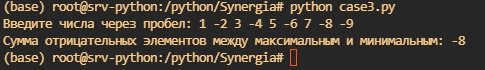

# Учебный проект: Сумма отрицательных элементов между максимальным и минимальным

# Общая информация
- Учебное заведение: Университет "Синергия"
- Тип проекта: Задание учебной практики (Кейс-задача №3)
- Студент: Нигматуллин Денис Аликович
- Язык программирования: Python

# Описание задачи
Дан одномерный массив A размерности N. Необходимо найти сумму отрицательных элементов, расположенных между максимальным и минимальным элементами массива.

# Реализация
Программа на Python, которая:
- Принимает на вход массив чисел
- Находит позиции минимального и максимального элементов
- Определяет диапазон между ними
- Суммирует все отрицательные элементы в этом диапазоне

# Пример работы

